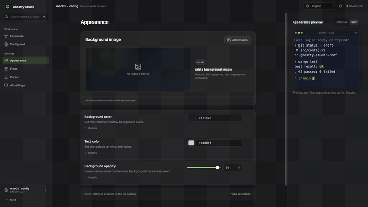

<div align="center">
  
  <h1>Ghostty Studio</h1>
  <p><strong>Edit the Ghostty config you actually use—without flattening it.</strong></p>
  <p>
    <a href="https://steinshead.github.io/ghostty-studio/">Website</a>
    · <a href="https://github.com/SteinsHead/ghostty-studio/releases/latest">Download for Apple Silicon</a>
    · <a href="docs/media/ghostty-studio-demo.mp4">Watch the 23-second demo</a>
    · <a href="README.zh-CN.md">简体中文</a>
  </p>

  [](https://github.com/SteinsHead/ghostty-studio/actions/workflows/ci.yml)
  [](https://github.com/SteinsHead/ghostty-studio/releases/latest)
  [](LICENSE)
</div>

<div align="center">
  <a href="docs/media/ghostty-studio-demo.mp4">
    
  </a>
</div>

Most configurators generate a clean new file. Ghostty Studio opens the one you already maintain and
changes only what you review.

- **Preserves your document.** Comments, ordering, includes, unknown keys, line endings, and blank
  lines stay where you put them.
- **Makes every write visible.** Preview the result and inspect the exact diff before anything reaches
  disk.
- **Asks Ghostty, then leaves a way back.** Ghostty validates the candidate and Studio creates a local
  restore point before saving.
- **Stays on your Mac.** No account, cloud service, telemetry, or remote image loading.

## Current support

| | Preview support |
|---|---|
| Mac | Apple Silicon, macOS 11 or later |
| Ghostty | Writable contract audited against Ghostty 1.3.1 |
| Languages | English and Simplified Chinese |
| Distribution | Ad-hoc signed, not Apple-notarized |

Read the exact version and configuration boundaries in the
[compatibility guide](docs/COMPATIBILITY.md).

## The journey

1. **Open the real source.** Studio discovers the standard macOS and XDG roots, follows supported
   includes, and explains when another source wins.
2. **Adjust with context.** Search reviewed settings or use the background studio for local PNG and
   JPEG images, fit, position, tiling, visibility, and switching.
3. **Review the write.** Nothing leaves the draft until you inspect its summary and exact diff.
4. **Validate and save.** Studio checks for outside edits, asks the installed Ghostty to validate,
   writes atomically, and keeps a private restore point.

Settings whose type, range, source behavior, or version contract is not yet proven remain searchable
but read-only. Studio does not guess at write semantics.

## Download

[Download the latest preview](https://github.com/SteinsHead/ghostty-studio/releases/latest) for an
Apple Silicon Mac running macOS 11 or later. The release page includes a SHA-256 checksum.

macOS may ask you to confirm the first launch because the preview is not notarized. Use the normal
macOS security review flow; do not disable Gatekeeper. You can also build from source.

## Run from source

You need Ghostty, Xcode Command Line Tools, Node 22.11, pnpm 10, and the pinned Rust toolchain.

```bash
pnpm install --frozen-lockfile
pnpm tauri dev
```

Run the complete frontend, website, and Rust checks with:

```bash
pnpm check
```

`pnpm dev` opens a read-only browser demo with sample data. `pnpm package:macos-local` creates an
ad-hoc local package for development; it does not establish publisher identity.

## Documentation and help

- [Documentation index](docs/README.md)
- [Compatibility](docs/COMPATIBILITY.md)
- [Troubleshooting](docs/TROUBLESHOOTING.md)
- [Architecture](docs/ARCHITECTURE.md)
- [Threat model](docs/THREAT_MODEL.md)
- [Roadmap](docs/ROADMAP.md)
- [Security policy](SECURITY.md)

Bug reports, focused pull requests, and real Ghostty workflow feedback are welcome. Start with
[Support](SUPPORT.md) or [Contributing](CONTRIBUTING.md), and use only synthetic or fully redacted
configs, paths, logs, and media.

Ghostty Studio is open source under the [MIT license](LICENSE). It is an independent community
project and is not affiliated with or endorsed by Ghostty.
