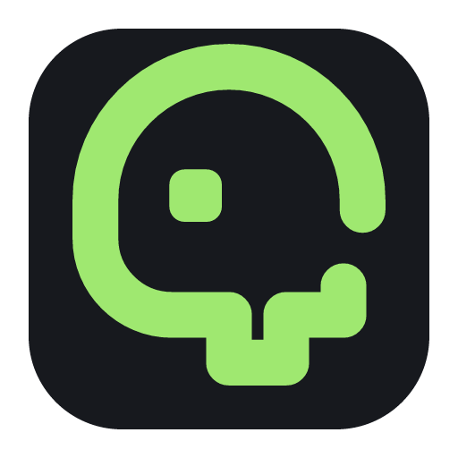

<div align="center">
  
  <h1>Ghostty Studio</h1>
  <p><strong>一个尊重原配置文件的 Ghostty 可视化配置器。</strong></p>
  <p><a href="README.md">English</a></p>

  [](https://github.com/SteinsHead/ghostty-studio/actions/workflows/ci.yml)
  [](LICENSE)
</div>

Ghostty 的配置能力很强，但在几百个选项里查名字、改文件、重启验证，并不轻松。
Ghostty Studio 是我为自己做的本地桌面配置器：搜索设置、实时预览、确认 diff，然后再
保存。它会尽量不碰你没有修改的内容。

## 能做什么

- 从本机安装的 Ghostty 读取设置目录，不用维护一份容易过期的静态表格。
- 发现 macOS 与 XDG 配置文件，并展示设置来自哪里。
- 搜索、分类浏览并实时预览已支持的视觉设置。
- 保存前展示准确 diff。
- 保留注释、顺序、未知设置、空行、BOM、CRLF 和末尾换行风格。
- 每次保存前都交给 Ghostty 验证，并自动创建本地快照。

所有内容都留在本机。应用不需要账号，没有云服务和遥测，也不会给界面通用的 shell
或文件访问能力。

## 下载

[下载 Ghostty Studio v0.1.0](https://github.com/SteinsHead/ghostty-studio/releases/tag/v0.1.0)，
适用于 macOS 11 或更高版本的 Apple Silicon Mac。

这是一个早期预览版。应用已做 ad-hoc 签名，但尚未经过 Apple 公证，所以 macOS 首次
打开时可能要求你确认。Release 页面附有 SHA-256 校验值；如果你更在意构建过程，也可以
直接从源码运行。

## 目前的状态

Ghostty Studio 仍是早期预览版，当前边界很明确：

- 桌面端目前以 macOS 为主，可写设置契约基于 Ghostty 1.3.1 测试。
- 只有一小组经过确认的视觉设置可以编辑；其他设置仍可搜索和查看，后续会逐步加入合适的编辑器。
- 预览安装包采用 ad-hoc 签名，尚未经过 Developer ID 签名和 Apple 公证。
- 界面目前为简体中文，英文界面在计划中。

## 本地运行

需要 macOS 11 或更高版本、Ghostty、Xcode Command Line Tools、Node 22.11、pnpm 10
和 Rust。仓库已经固定所需的 Node 与 Rust 版本。

```bash
pnpm install --frozen-lockfile
pnpm tauri dev
```

只体验不会访问本机配置的浏览器演示：

```bash
pnpm dev
```

运行全部前端与 Rust 检查：

```bash
pnpm check
```

构建适合本机安装的 ad-hoc `.app` 与 DMG：

```bash
pnpm package:macos-local
```

这个本地包用于开发和个人安装，尚未公证，也不能证明发布者身份。

## 保存时发生什么

Ghostty Studio 不会重新生成整份配置，而是在原文档上只修改你确认过的设置。替换文件
前，应用会检查是否有其他程序动过配置，让 Ghostty 验证候选内容，并保存一个可以恢复
的快照。

更完整的设计与安全细节放在文档中：

- [架构](docs/ARCHITECTURE.md)
- [威胁模型](docs/THREAT_MODEL.md)
- [扩展设计](docs/EXTENSIONS.md)
- [路线图](docs/ROADMAP.md)
- [安全策略](SECURITY.md)

## 参与项目

欢迎提交 bug、聚焦的小型 PR，以及来自真实 Ghostty 使用场景的建议。示例配置请务必
脱敏，不要附带令牌、私人路径、命令或环境变量值。

## 许可证

[MIT](LICENSE)

Ghostty Studio 是独立的社区项目，与 Ghostty 官方没有隶属或背书关系。
